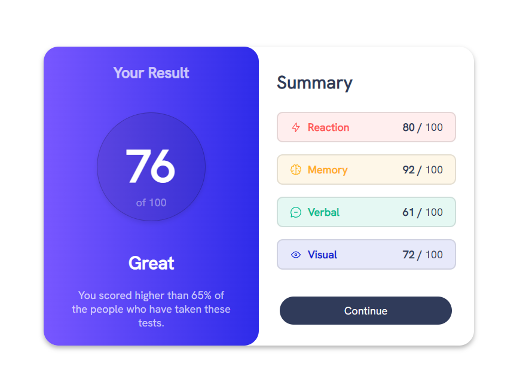
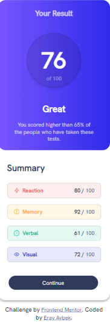

# Frontend Mentor - Results summary component solution

This is a solution to the [Results summary component challenge on Frontend Mentor](https://www.frontendmentor.io/challenges/results-summary-component-CE_K6s0maV). Frontend Mentor challenges help you improve your coding skills by building realistic projects.

## Table of contents

- [Overview](#overview)
  - [The challenge](#the-challenge)
  - [Screenshot](#screenshot)
  - [Links](#links)
- [My process](#my-process)
  - [Built with](#built-with)
  - [What I learned](#what-i-learned)
  - [Continued development](#continued-development)
  - [Useful resources](#useful-resources)
- [Author](#author)

## Overview

### The challenge

Users should be able to:

- View the optimal layout for the interface depending on their device's screen size
- See hover and focus states for all interactive elements on the page

### Screenshot

<p align="center">


</p>

### Links

- Solution URL: [Add solution URL here](https://github.com/eraybek/front-end-projects/tree/main/20-ResultSummaryComponent)
- Live Site URL: [Add live site URL here](https://your-live-site-url.com)

## My process

### Built with

- Semantic HTML5 markup
- CSS custom properties
- Flexbox

### What I learned

```html

```

```css
@font-face {
  font-family: "Hanken-Grotesk";
  src: url("./assets/fonts/HankenGrotesk-VariableFont_wght.ttf");
  font-weight: normal;
  font-style: normal;
}

@media screen and (max-width: 375px) {
  .main {
    display: flex;
    flex-direction: column;
    width: 375px;
  }

  .result-section,
  .summary-section {
    width: 100%;
    margin: 0;
    padding: 0;
  }
}
```

### Continued development

### Useful resources

- [W3 Schools](https://www.w3schools.com/html/html_responsive.asp) - This helped me for responsive design. I really liked this pattern and will use it going forward.

## Author

- Website - [Eray Aybek](https://eraybek.github.io)
- Frontend Mentor - [@eraybek](https://www.frontendmentor.io/profile/eraybek)
- GitHub - [@eraybek](https://github.com/eraybek)
